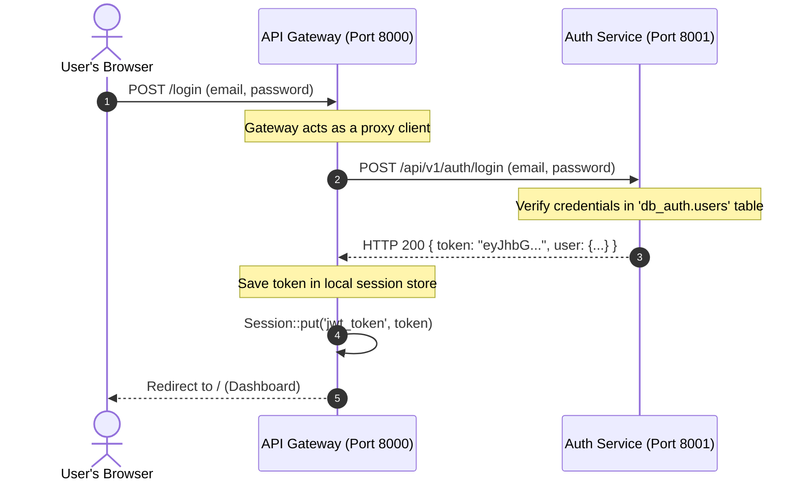
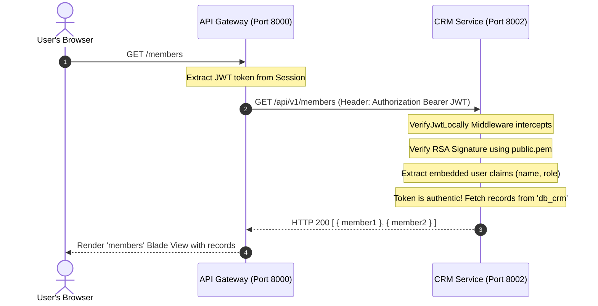
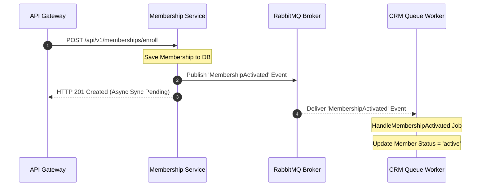

# FitLife ERP Architecture & System Flow

This document explains the architecture, microservices layout, authentication design, key request flows, prerequisites, and instructions for running the FitLife fitness center ERP system.

---

## 1. High-Level Architecture & Paradigm

The FitLife ERP is structured as a **Microservice Architecture** composed of six independent Laravel 11 services. Each service resides in its own isolated directory, is packaged as a lightweight Docker container, and communicates over HTTP inside a private virtual network.

```mermaid
graph TD
    User([User's Browser]) <-->|HTTP / HTML / Cookies| Gateway["API Gateway (Port 8000)"]
    
    subgraph Private Docker Network (fitlife-network)
        Auth["Auth Service (Port 8001)"]
        CRM["CRM Service (Port 8002)"]
        Membership["Membership Service (Port 8003)"]
        HR["HR Service (Port 8004)"]
        Reporting["Reporting Service (Port 8005)"]
        MySQL["MySQL Shared Database (Port 3306)"]
        RabbitMQ["RabbitMQ Message Broker (Port 5672)"]
        Redis["Redis Cache (Port 6379)"]
    end

    Gateway -->|1. Authenticate| Auth
    Gateway -->|2. Manage Members| CRM
    Gateway -->|3. Manage Plans & Subscriptions| Membership
    Gateway -->|4. Manage HR & Assignment| HR
    Gateway -->|5. Aggregate Dashboard Reports| Reporting
    
    %% Inter-service communication (Event-Driven)
    Membership -->|Publish MembershipActivated| RabbitMQ
    RabbitMQ -->|Consume MembershipActivated| CRM
    
    %% Database connections
    Auth -->|Read/Write| MySQL
    CRM -->|Read/Write| MySQL
    Membership -->|Read/Write| MySQL
    HR -->|Read/Write| MySQL
    Reporting -->|Read/Write| MySQL

    style Gateway fill:#6366f1,stroke:#4f46e5,color:#fff,stroke-width:2px
    style Auth fill:#475569,stroke:#1e293b,color:#fff
    style CRM fill:#475569,stroke:#1e293b,color:#fff
    style Membership fill:#475569,stroke:#1e293b,color:#fff
    style HR fill:#475569,stroke:#1e293b,color:#fff
    style Reporting fill:#475569,stroke:#1e293b,color:#fff
    style MySQL fill:#10b981,stroke:#047857,color:#fff
    style RabbitMQ fill:#f97316,stroke:#ea580c,color:#fff
    style Redis fill:#dc2626,stroke:#b91c1c,color:#fff
```

### Why Microservices?
Unlike a traditional monolithic application, the FitLife ERP breaks down business operations into distinct logical boundaries:
1. **Separation of Concerns**: Changes to the member tracking system (CRM) do not affect payroll or personal trainer management (HR).
2. **Scalability**: High-throughput services (like Reporting) can be scaled independently of stable, rarely modified services.
3. **Database Separation**: While sharing a MySQL server in this local development environment, each service reads and writes to its own isolated database schema (`db_auth`, `db_crm`, `db_membership`, `db_hr`, `db_reporting`).

---

## 2. Service Responsibilities & Network Layout

| Service | Host Port | Internal Container Port | Internal DNS (Docker Network) | Core Responsibility |
|---|---|---|---|---|
| **API Gateway** | `8000` | `80` | `http://api-gateway` | The entry-point for browsers. Serves Blade-rendered HTML views, manages login session state, and orchestrates calls to backend microservices. |
| **Auth Service** | `8001` | `80` | `http://auth-service` | Single source of truth for identity management. Performs password hashing, token validation, and JWT generation. |
| **CRM Service** | `8002` | `80` | `http://crm-service` | Stores and manages gym member demographics, registration logs, and physical health status profiles. |
| **Membership Service**| `8003` | `80` | `http://membership-service` | Handles subscriptions, billing dates, automatic renewals, and plan catalog pricing. |
| **HR Service** | `8004` | `80` | `http://hr-service` | Manages active trainers, desk managers, employee logs, and member-to-personal-trainer assignments. |
| **Reporting Service** | `8005` | `80` | `http://reporting-service` | Gathers raw metrics from internal services (CRM and Membership) and performs statistical aggregation for dashboard visualization. |
| **MySQL Database** | `3307` | `3306` | `mysql` | Persists structural relational data across individual schemas for all microservices. |
| **RabbitMQ** | `5672/15672` | `5672` | `rabbitmq` | Message broker handling asynchronous event-driven communication (e.g., Membership updates CRM). |
| **Redis** | `6379` | `6379` | `redis` | In-memory datastore used for caching and queueing. |

---

## 3. How the System Works: Key Request Flows

### Flow A: Login & Session Authentication Flow

When a user visits the login portal and submits their credentials, the transaction propagates as follows:



1. **User Request**: The user fills in the form at `http://localhost:8000/login`.
2. **Gateway Forwarding**: The API Gateway catches the HTTP POST request. It makes a backend HTTP call to `http://auth-service/api/v1/auth/login`.
3. **Identity Verification**: The Auth Service matches the user against the database and returns a signed JSON Web Token (JWT).
4. **Session Capture**: The API Gateway intercepts this token and places it in the browser's secure server-side PHP session.
5. **Dashboard Entrance**: The Gateway issues a `302 Redirect` to `/`, allowing the browser to render the main administrative dashboard.

### Flow B: Stateless JWT Authorization (RS256)

Instead of pinging the Auth Service for every single request, consumer services now verify JWTs locally using a mounted RSA public key:



1. **Request Interception**: A request is received at the Gateway for `/members`. The Gateway forwards the JWT token.
2. **Back-end Delegation**: The Gateway requests the member list from the CRM Service (`GET http://crm-service/api/v1/members`).
3. **Local Verification**: The CRM Service intercepts the incoming request using its `VerifyJwtLocally` middleware. It uses the `public.pem` RSA key (mounted via Docker volume) to mathematically verify the token signature.
4. **Claim Extraction**: It extracts the user's details (ID, name, role) directly from the token payload, eliminating the need for a network round-trip to the Auth Service.
5. **Response Assemblage**: The CRM Service fulfills the query, returning the list to the Gateway.

### Flow C: Event-Driven Inter-Service Communication

Instead of synchronous HTTP calls that can drop or block, state changes are handled asynchronously via RabbitMQ:



1. **Enrollment**: The Membership service successfully enrolls a member in a plan.
2. **Publishing**: Instead of calling the CRM service via HTTP, it publishes a `MembershipActivated` event to the RabbitMQ exchange.
3. **Immediate Response**: It immediately returns a success response to the user.
4. **Consumption**: A background queue worker running in the CRM container picks up the event from RabbitMQ and updates the member's status to `active` in the CRM database.

---

## 4. Prerequisites & Port Mapping Integrity

To successfully start and run this system, your development computer must meet the following prerequisites:

### 1. Software Requirements
* **Docker Desktop**: Must be installed, configured, and running.
* **Modern Web Browser**: Chrome, Firefox, Safari, or Edge.

### 2. Available Network Ports
The services bind to the host system ports. Please ensure that the following ports are **not occupied** by other applications:
* `8000` (API Gateway)
* `8001` (Auth Service)
* `8002` (CRM Service)
* `8003` (Membership Service)
* `8004` (HR Service)
* `8005` (Reporting Service)
* `3307` (MySQL Server)

> [!WARNING]
> **Port 80 Conflict & Loop Redirects**
> If you have a local web server (like **Apache**, **Nginx**, **IIS**, or **XAMPP**) running natively on port `80` on your computer, your browser may drop the `:8000` suffix during redirects if Laravel's URL generation is not configured.
>
> **What we've fixed**: The API Gateway includes configuration in `AppServiceProvider.php` that binds the Laravel URL generator directly to the mapped `APP_URL` port (`8000`). If you hit an Apache 404 screen, verify that you are explicitly typing and visiting **`http://localhost:8000`** in your browser instead of `http://localhost`.

---

## 5. How to Run the System (Step-by-Step)

### Step 1: Clone and Prepare
Navigate to the root directory where the `docker-compose.yml` file is located:
```bash
cd c:/Users/rizza/fitlife-erp
```

### Step 2: Generate RSA Keys (One-Time Setup)
Run the script to generate the RS256 key pair used for JWT token signing and verification:
```bash
bash docker/jwt-keys/generate-keys.sh
```

### Step 3: Build and Run Containerized Services
Launch the entire infrastructure stack in detached mode using Docker Compose:
```bash
docker compose up -d --build
```
*The `--build` flag ensures that any changes to source code or environment variables are fresh and re-compiled into the container images.*

During the startup phase, the **entrypoint scripts** inside the containers automatically:
1. Block and wait until the MySQL, RabbitMQ, and Redis servers are healthy.
2. Initialize separate database schemas (`db_auth`, `db_crm`, `db_membership`, `db_hr`, `db_reporting`).
3. Run migrations (`php artisan migrate --force`).
4. Seed mock development records idempotently.

### Step 3: Access the Portal
Open your web browser and go to:
👉 **[http://localhost:8000](http://localhost:8000)**

### Step 4: Sign In
On the login screen, enter the standard development credentials:
* **Email**: `test@example.com`
* **Password**: `password`

---

## 6. Diagnostic and Maintenance Toolkit

Use these commands in your console to monitor and troubleshoot the microservice grid:

### 1. View Run Status and Mapped Ports
```bash
docker compose ps
```
*Expected: All 7 containers should be listed as `Up`.*

### 2. Tail Live Log Streams
If you encounter errors, trace them in real-time.
* View Gateway logs:
  ```bash
  docker compose logs -f api-gateway
  ```
* View CRM service logs:
  ```bash
  docker compose logs -f crm-service
  ```

### 3. Clear and Refresh Cache
When you make changes to environment variables or settings, clear cached assets:
```bash
docker compose exec api-gateway php artisan config:clear
docker compose exec api-gateway php artisan cache:clear
```

### 4. Shutdown the Grid
To completely power down the system and free system RAM:
```bash
docker compose down
```
*Your relational data is safe and persisted in the `mysql_data` Docker volume.*
